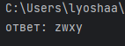

# lab1

## Задание
Миша заполнял таблицу истинности функции ((x → y) ∨ (z ≡ x)) ∧ (w → z), но успел заполнить лишь фрагмент из трёх различных её строк, даже не указав, какому столбцу таблицы соответствует каждая из переменных w, x, y, z. 

Определите, какому столбцу таблицы истинности функции F соответствует каждая из переменных x, y, z, w. В ответе напишите буквы w, x, y, z в том порядке, в котором идут соответствующие им столбцы.

## Проделанная работа
Написал программу, которая перебирает все возможные перестановки переменных, вычисляет логическую функцию по формуле и сравнивает результат с заданной таблицей.

## Скриншоты

